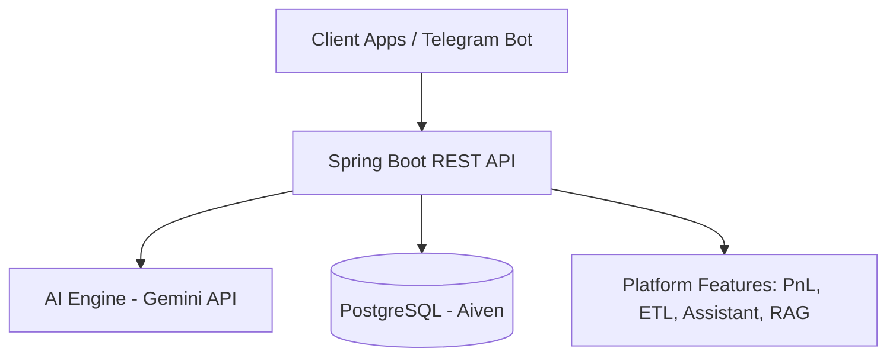
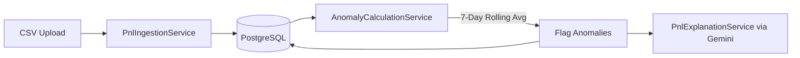
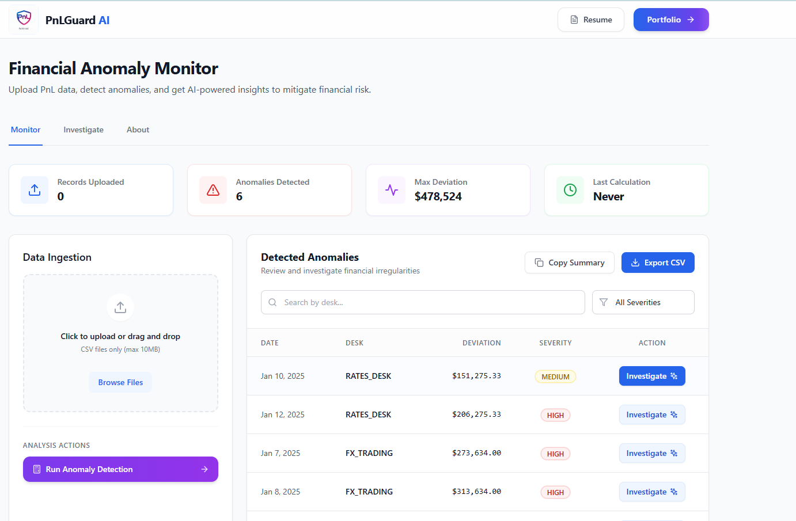
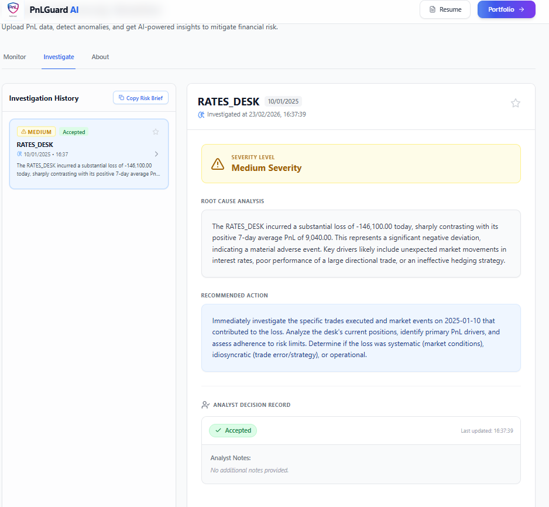
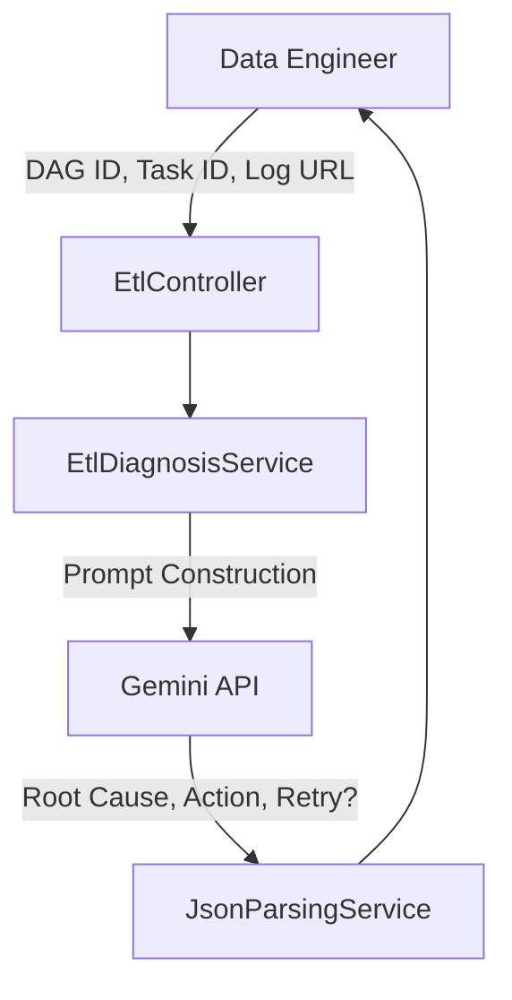
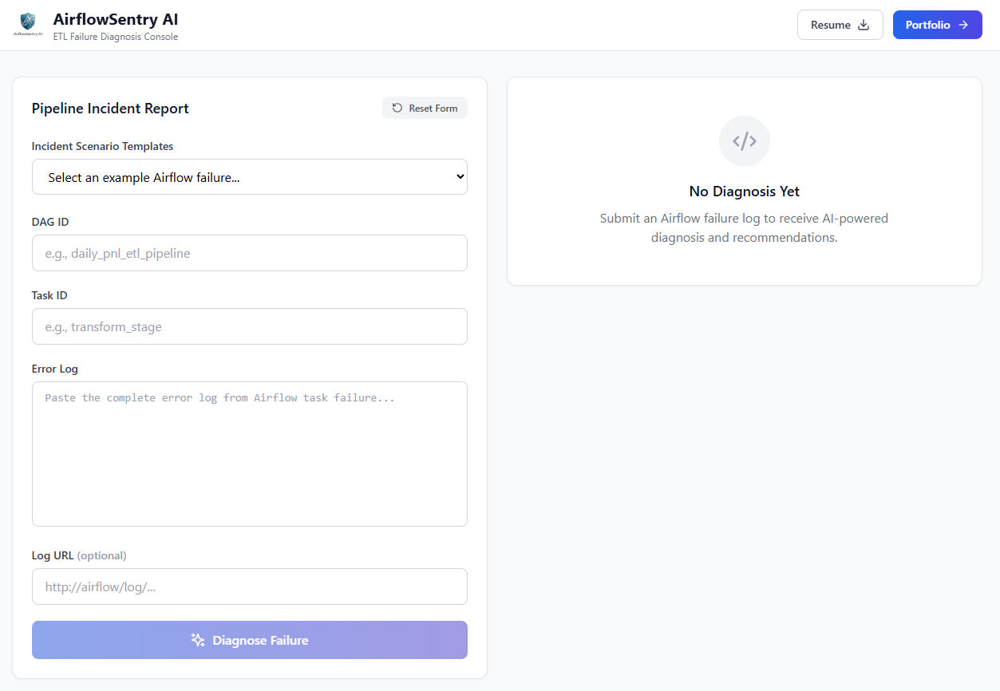
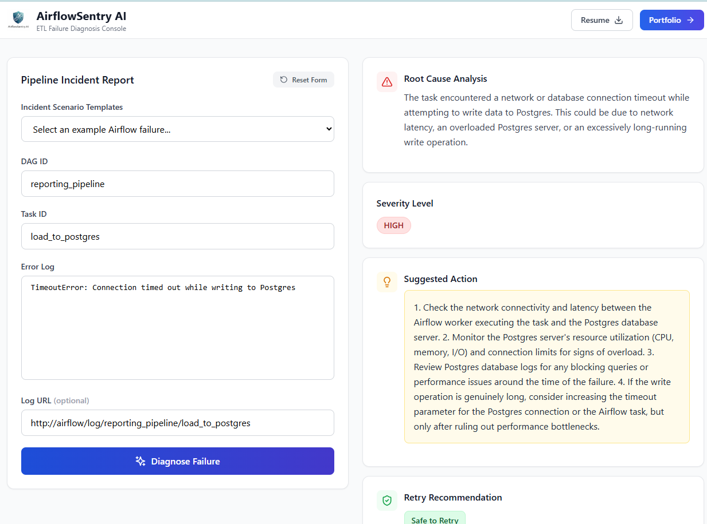

# AI Decision Platform

[](https://spring.io/projects/spring-boot)
[](https://www.oracle.com/java/)
[](https://www.postgresql.org/)
[](https://deepmind.google/technologies/gemini/)

The **AI Decision Platform** is a centralized intelligence hub built with Spring Boot. It leverages Google's Gemini LLM to provide actionable insights, automate diagnostics, and serve as an intelligent assistant for various user personas (Risk Managers, Data Engineers, Product Owners) within financial and trading domains.

## 🏗️ System Architecture



The platform is built on a modular architecture, integrating a core AI engine with distinct feature domains, backed by a PostgreSQL database and containerized via Docker.

---

## 🚀 Key Features / Projects

### 1. 📈 PnL Anomaly Detection & AI Explanation
Tracks daily Profit & Loss (PnL) records per desk, automatically calculates anomalies based on deviations from a 7-day rolling average, and uses AI to explain the root cause and severity of the anomaly.

**Architecture Flow:**


<!-- Screenshot 1: PnL Dashboard / Graph (Replace with your screenshot) -->


<!-- Screenshot 2: AI Explanation Result Snippet (Replace with your screenshot) -->


### 2. 🛠️ ETL Pipeline Diagnosis
Designed for data engineering teams, this module diagnoses failing Directed Acyclic Graphs (DAGs) and tasks. By analyzing error logs and task metadata, the AI engine determines the root cause, severity, suggested actions, and whether a retry is safe.

**Architecture Flow:**


<!-- Screenshot 1: Airflow / DAG Failure Example (Replace with your screenshot) -->


<!-- Screenshot 2: AI Root Cause Analysis & Retry Safety (Replace with your screenshot) -->


### 3. 🤖 Persona-Based Assistant
Provides a specialized chat interface powered by RAG (Retrieval-Augmented Generation), allowing users to query platform data and documentation using natural language tailored to their specific roles.

## 🛠️ Getting Started

### Prerequisites
- Java 17+ & Maven 3.8+
- Docker & Docker Compose
- Google Gemini API Key

### Installation
1. **Clone the repository:**
   ```bash
   git clone https://github.com/your-username/ai-decision-platform.git
   cd ai-decision-platform
   ```
2. **Configure Environment:**
   Create an `application-local.yml` or set environment variables for `GOOGLE_AI_API_KEY` and your PostgreSQL credentials.
3. **Run with Docker:**
   ```bash
   docker-compose up -d
   ```
4. **Launch Application:**
   ```bash
   mvn spring-boot:run
   ```