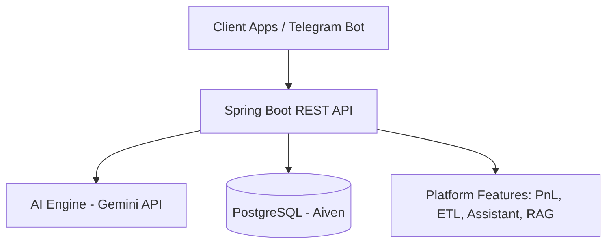
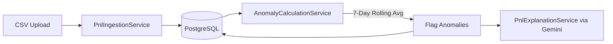
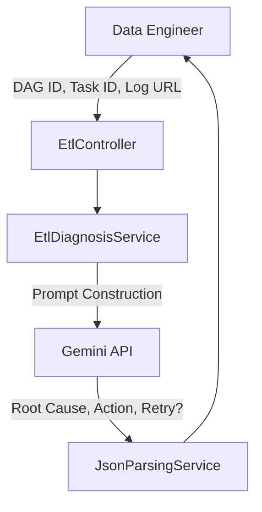
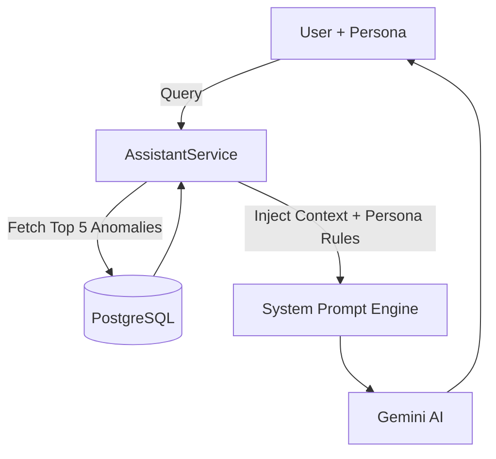
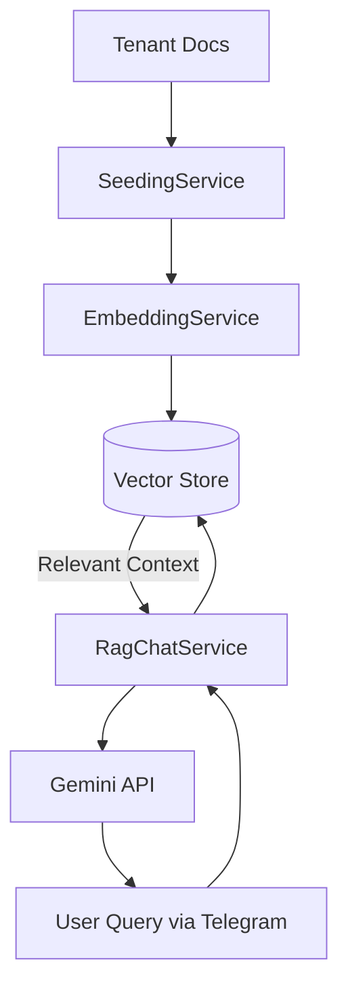

# AI Decision Platform

[](https://spring.io/projects/spring-boot)
[](https://www.oracle.com/java/)
[](https://www.postgresql.org/)
[](https://deepmind.google/technologies/gemini/)

The **AI Decision Platform** is a centralized intelligence hub built with Spring Boot. It leverages Google's Gemini LLM to provide actionable insights, automate diagnostics, and serve as an intelligent assistant for various user personas (Risk Managers, Data Engineers, Product Owners) within financial and trading domains.

## 🏗️ System Architecture



The platform is built on a modular architecture, integrating a core AI engine with distinct feature domains, backed by a PostgreSQL database and containerized via Docker.

---

## 🚀 Key Features / Projects

### 1. 📈 PnL Anomaly Detection & AI Explanation
Tracks daily Profit & Loss (PnL) records per desk, automatically calculates anomalies based on deviations from a 7-day rolling average, and uses AI to explain the root cause and severity of the anomaly.

**Architecture Flow:**


<!-- Screenshot 1: PnL Dashboard / Graph (Replace with your screenshot) -->


<!-- Screenshot 2: AI Explanation Result Snippet (Replace with your screenshot) -->


### 2. 🛠️ ETL Pipeline Diagnosis
Designed for data engineering teams, this module diagnoses failing Directed Acyclic Graphs (DAGs) and tasks. By analyzing error logs and task metadata, the AI engine determines the root cause, severity, suggested actions, and whether a retry is safe.

**Architecture Flow:**


<!-- Screenshot 1: Airflow / DAG Failure Example (Replace with your screenshot) -->


<!-- Screenshot 2: AI Root Cause Analysis & Retry Safety (Replace with your screenshot) -->


### 3. 🤖 Persona-Based AI Assistant
Provides tailored insights based on user roles (`RISK_MANAGER`, `DATA_ENGINEER`, `PRODUCT_OWNER`). The assistant queries recent system anomalies and feeds them as context to the AI, allowing users to ask natural language questions and receive persona-specific advice.

**Architecture Flow:**


<!-- Screenshot 1: Assistant Persona Selection (Replace with your screenshot) -->


<!-- Screenshot 2: Persona-Specific AI Response (Replace with your screenshot) -->


### 4. 📚 Retrieval-Augmented Generation (RAG) & Telegram Bot
Embeds tenant-specific documentation into a vector store to ground AI responses in real data, reducing hallucinations. Additionally, features a fully integrated Telegram Bot for conversational AI access on the go.

**Architecture Flow:**


<!-- Screenshot 1: Document Seeding Workflow (Replace with your screenshot) -->


<!-- Screenshot 2: Telegram Bot Chat Interface (Replace with your screenshot) -->


---

## 🛠️ Technology Stack
- **Backend:** Java 17, Spring Boot 3.5.10
- **Database:** PostgreSQL (via Aiven Cloud), Spring Data JPA / Hibernate
- **AI Integration:** Google Gemini API (Custom Client with Failover logic)
- **API Documentation:** Springdoc OpenAPI (Swagger UI)
- **Build & Deployment:** Gradle, Docker

## 🐳 Docker Build Instructions

To build and run the application using Docker, follow these steps:

1. **Build the application**:
   ```bash
   ./gradlew clean bootJar
   ```

2. **Build the Docker image**:
   ```bash
   docker build -t sdeashirvad/ai-decision-platform:latest .
   ```

3. **Run the Docker container**:
   ```bash
   docker run -p 8080:8080 --env-file .env sdeashirvad/ai-decision-platform:latest
   ```

4. **Run the Docker container in detached mode**:
   ```bash
   docker run -d -p 8080:8080 --env-file .env sdeashirvad/ai-decision-platform:latest
   ```

## ⚙️ Environment Variables Required
Create a `.env` file in the root directory (or `.env.example`) with the following variables:
```env
AI_API=your_gemini_api_key_1
AI_API_2=your_gemini_api_key_2
AI_API_3=your_gemini_api_key_3
BOT_TOKEN=your_telegram_bot_token
```
*(Database credentials and Telegram API URLs are pre-configured in `application.yml`)*

## 📚 API Documentation
Once the application is running, you can access the interactive Swagger UI API documentation at:
`http://localhost:8080/swagger-ui.html`
